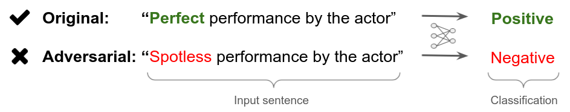
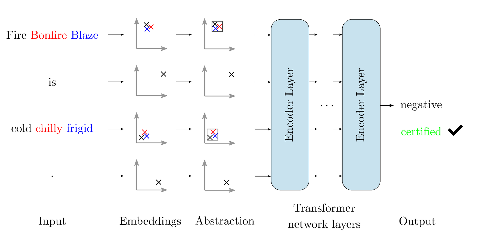
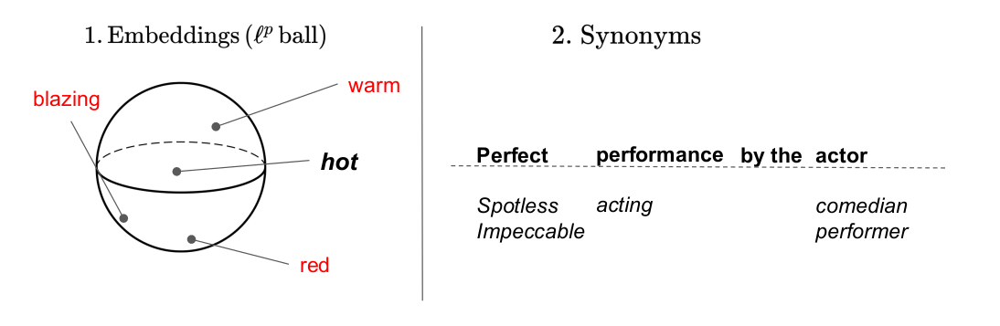
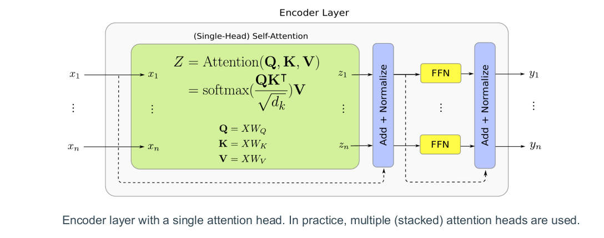

# DeepT - Multi-norm Zonotopes & Transformer certification

We present **DeepT**, a novel method for certifying Transformer networks based on 
abstract interpretation, as presented in our PLDI 2021 paper
"[Fast and precise certification of transformers](https://dl.acm.org/doi/abs/10.1145/3453483.3454056)". This repository contains all code and data necessary to reproduce the
results from the paper, as well as the complete experimental results.

## Attacks & Certification of Natural Language Models

Neural networks for Natural Language Processing are vulnerable to
adversarial examples, where a meaning-preserving change to the sentence
causes the model to make incorrect predictions.

The goal of the DeepT verifier is to **prove the local robustness** of Transformer
networks against certain threat models for given input sequences. In other words, 
given an input, we aim to guarantee the model will always produce the right 
prediction for all variations of the input described by the threat model (synonym replacements
and embedding changes, see Threat Models section below).

## Multi-norm Zonotopes

The key idea behind DeepT is our new multi-norm Zonotope
abstract domain, an extension of the classical Zonotope designed to handle L1 
and L2-norm bound perturbations. 

We introduce all Multi-norm Zonotope abstract transformers necessary to handle
these complex networks, including the challenging softmax function and dot 
product. The abstract transformers are carefully constructed to strike a
good balance between precision and performance.

## Threat models

We consider 2 threat models: attacks in the embedding space within a l^p ball and synonym attacks
where each word may be replaced a synonym.

## Transformer networks

Transformer networks have delivered state-of-the-art
performance across many NLP tasks, and were also successfully applied to a wide
variety of other tasks including object detection, graph classification, speech
recognition, and visual question answering. The core part of a Transformer
network is a stack of self-attention layers. For NLP tasks, the
first layer of this stack is preceded by an embedding layer,
mapping words to vectors in an embedding space.  

## Evaluation Results

Our evaluation shows that DeepT can certify average robustness radii that are $28\times$ 
larger than the state-of-the-art, while scaling favorably. Further, for the 
first time, we certify Transformers against synonym attacks on long sequences 
of words, where each word can be replaced by any synonym. DeepT achieves a high
certification success rate on sequences of words where enumeration-based 
verification would take 2 to 3 orders of magnitude more time.

## Requirements

DeepT requires a GNU/Linux system with:
- An NVIDIA GPU with at least 11 GB of RAM to run the experiments that only use DeepT-Fast and CROWN-BaF
- An NVIDIA GPU with at least 24 GB of RAM for the full reproduction of all the experiments
- Installed CUDA drivers supporting CUDAlib 10.

## Installation

1. Go into the `Robustness-Verification-for-Transformers/reproduce_results` 
directory: `cd Robustness-Verification-for-Transformers/reproduce_results`
2. Run `install.sh` script to install Miniconda, create an environment with the dependencies
installed and download the data used in the experiments: `./install.sh`

## Getting started

To run the DeepT and certify a Transformer network against a synonym attack, follow 
these instructions:

1. Install the DeepT library (as well as the CROWN baseline) as described 
   in the `Installation` section.
2. Go into the `Robustness-Verification-for-Transformers/reproduce_results` 
   directory: `cd Robustness-Verification-for-Transformers/reproduce_results`
3. Run the script `get_results_synonym_attack.sh`, which will produce the statistics in
   stdout.

To run the DeepT and certify a Transformer network against a L2 attack on the embeddings
for a Transformer with 6 layers, follow these instructions:

1. Install the DeepT library (as well as the CROWN baseline) as described 
   in the `Installation` section.
2. Go into the `Robustness-Verification-for-Transformers/getting_started` 
   directory: `cd Robustness-Verification-for-Transformers/getting_started`
3. Run the script `get_results_fast_getting_started.sh`, which will produce the statistics in
   stdout.

## Step-by-Step Instructions to Reproduce Full Article Results

**Preliminary step**: go into the `Robustness-Verification-for-Transformers/reproduce_results` 
directory.

### Obtaining the (raw) results for each table

**All tables**

To compute **results for all Tables**, run the script `get_results_all_tables.sh`, which will store the results in 
the `Robustness-Verification-for-Transformers/results` directory, organized per experiment / Table.

**Table 1, 2, 3, 4, 5, 6, 7, 13**

To compute **the results for a particular Table**, for example Table 3, run the 
script `get_results_table3.sh`, which will store the results for that experiment / Table 
in a subdirectory of the `Robustness-Verification-for-Transformers/results` directory.

### Obtaining a summary of the data for each table

1. Run `open_notebook.sh` script to start Jupyter. 
2. Select the `Analysis.ipynb`.
3. Run all the cells in the notebook.

### Reproducing the synonym attack results

Run the script `get_results_synonym_attack.sh`, which will produce the statistics in stdout.

### Reference results

The reference results for Tables 1, 2, 3, 4, 5, 6, 7, 13 as well as the Analysis notebook obtain the result statistics are present in the `reference_results`.

## Other platforms

The installation instructions and the scripts to obtain the results are for GNU/Linux. 
DeepT can be used on other platforms, provided the dependencies are met.
Feel free to write a pull request with working scripts for your favourite platform.

# Datasets

## SST

The files for the SST dataset [1] originate from 2 sources:

1. The TXT files can be downloaded from the
   [Stanford NLP Sentiment Analysis](https://nlp.stanford.edu/sentiment/index.html) 
   page using 
   [this link](https://nlp.stanford.edu/sentiment/trainDevTestTrees_PTB.zip).
2. The TSV files can be downloaded from the 
   [GLUE benchmark](https://gluebenchmark.com/tasks)
   page using
   [this link](https://dl.fbaipublicfiles.com/glue/data/SST-2.zip).

## Yelp

The Yelp dataset is available at [https://www.yelp.com/dataset](https://www.yelp.com/dataset).

The Yelp reviews polarity dataset is constructed by Xiang Zhang 
(xiang.zhang@nyu.edu) from the above dataset. It is first used as a
text classification benchmark in [2].

## References

[1] Richard Socher, Alex Perelygin, Jean Wu, Jason Chuang, Christopher D.
Manning, Andrew Y. Ng, and Christopher Potts. 2013. Recursive Deep
Models for Semantic Compositionality Over a Sentiment Treebank. In
EMNLP. ACL, 1631–1642.

[2] Xiang Zhang, Junbo Zhao, Yann LeCun. Character-level Convolutional 
Networks for Text Classification. Advances in Neural Information Processing 
Systems 28 (NIPS 2015).